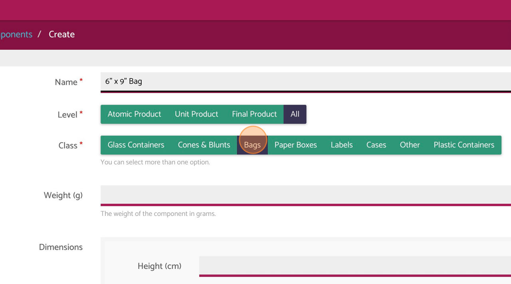
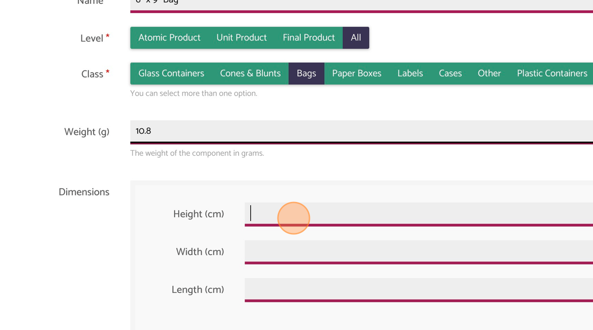

+++
title = "Create a component"
date = "2024-01-27T21:52:12-03:00"
draft = false
weight = 2
+++

**1.** Navigate to \"Components\" tab

**2.** Click \"Create\"

**3.** Complete the component name

**4.** Select the component level

**5.** Select the class

**6.** Enter the weight in grams

**7.** Fill out Dimensions section:
 heigth, width and length

**8.** Click \"Create\"

