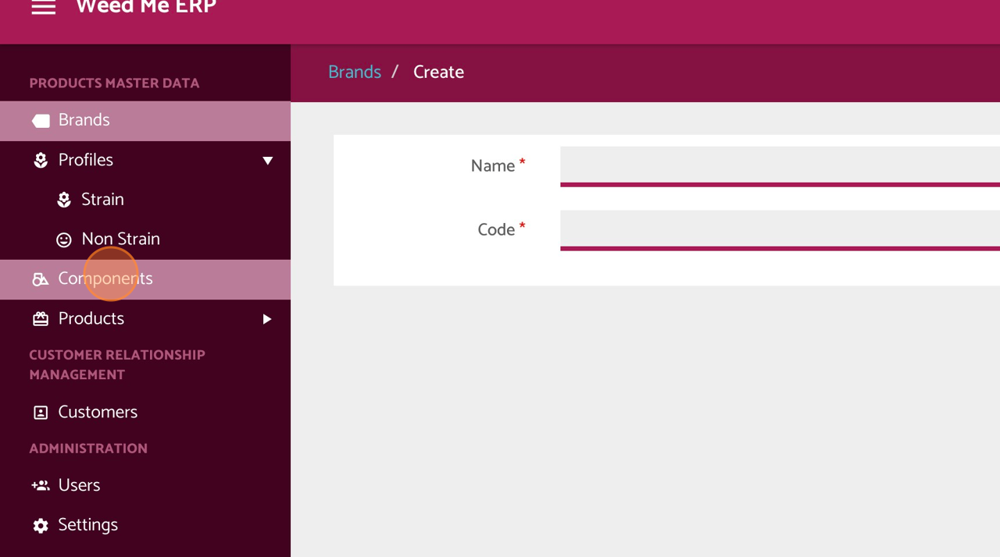
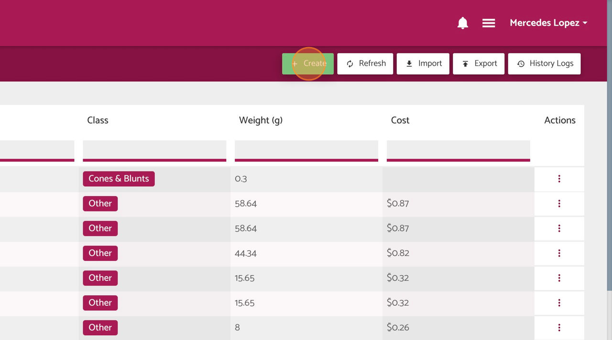
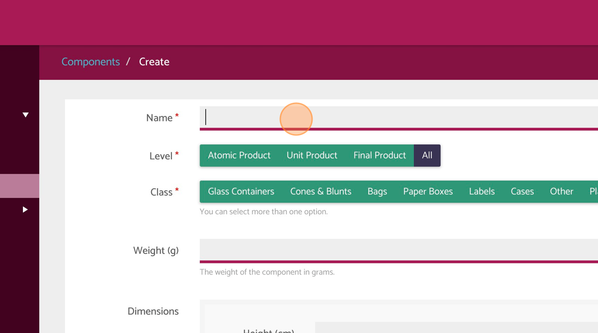
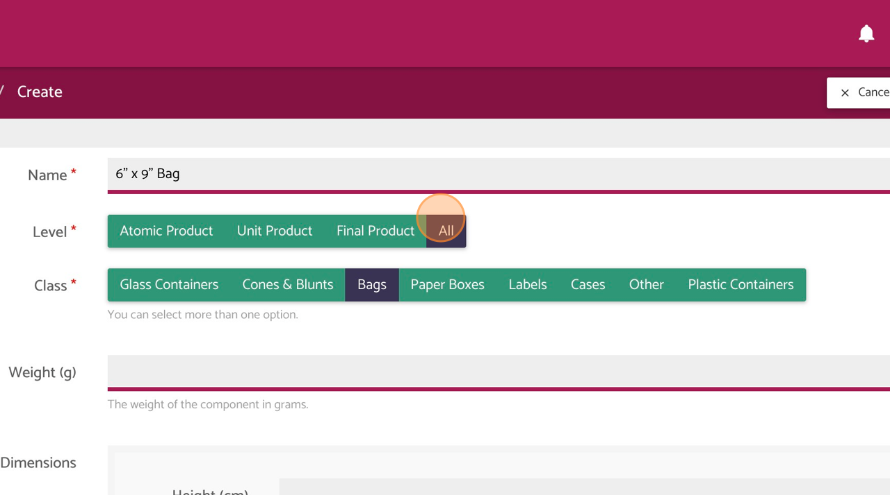
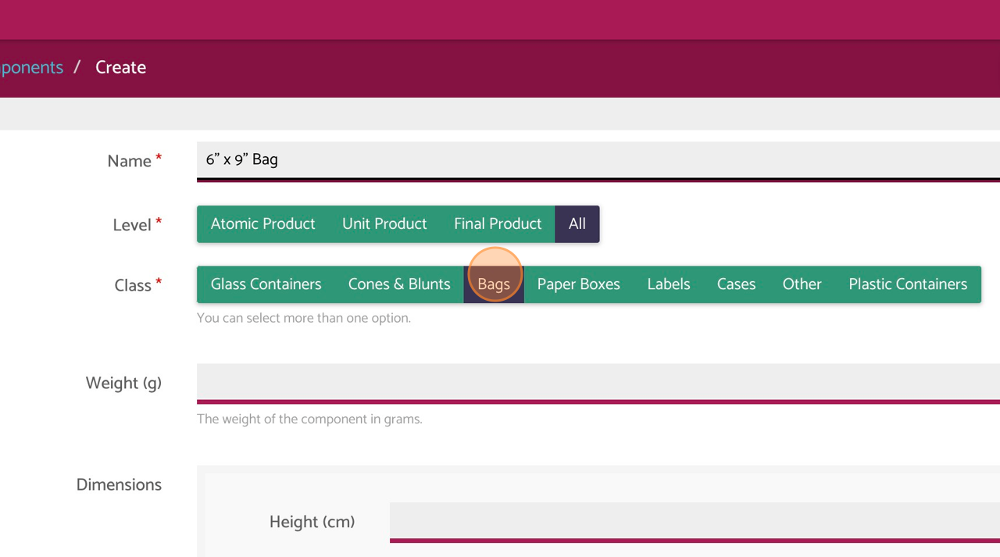
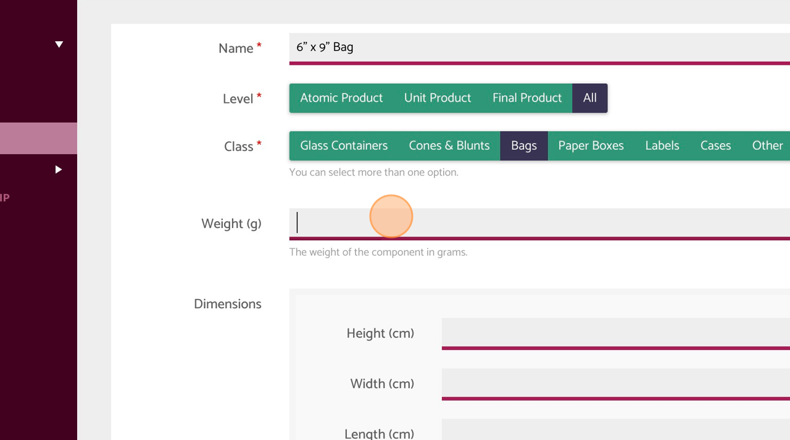
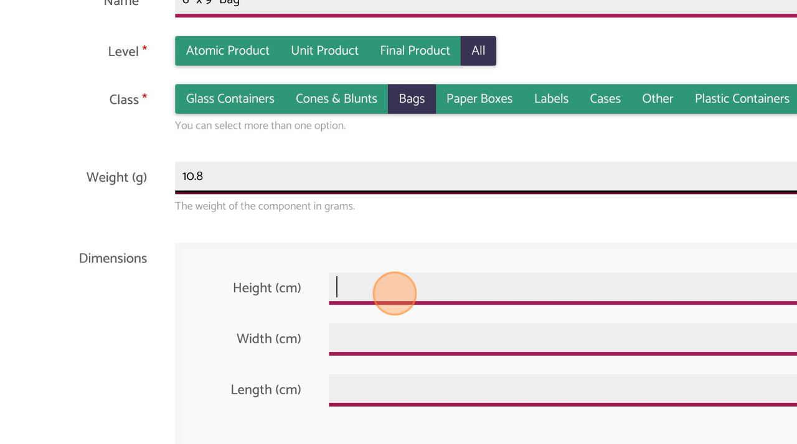
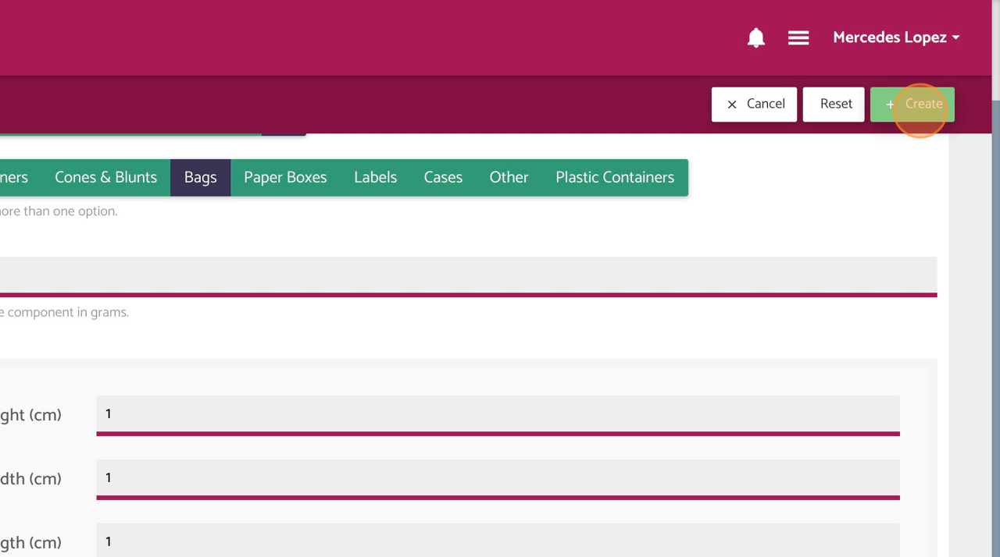

{width="0.8888888888888888in"
height="0.2638888888888889in"}**3.1.** **Create** **a** **Component**

 **1** Log in as a User

 {width="6.444444444444445in"
 height="3.5947911198600173in"}**2** Navigate to \"Components\" tab

Made with Scribe - https://scribehow.com 1

 {width="6.444444444444445in"
 height="3.5947911198600173in"}**3** Click \"Create\"

 {width="6.444444444444445in"
 height="3.5947911198600173in"}**4** Complete the component name

Made with Scribe - https://scribehow.com 2

 {width="6.444444444444445in"
 height="3.5947911198600173in"}**5** Select the component level

 {width="6.444444444444445in"
 height="3.5947911198600173in"}**6** Select the class

Made with Scribe - https://scribehow.com 3

 {width="6.444444444444445in"
 height="3.5947911198600173in"}**7** Enter the weight in grams

 {width="6.444444444444445in"
 height="3.5947911198600173in"}**8** Fill out Dimensions section:
 heigth, width and length

Made with Scribe - https://scribehow.com 4

 {width="6.444444444444445in"
 height="3.5947911198600173in"}**9** Click \"Create\"

Made with Scribe - https://scribehow.com 5
